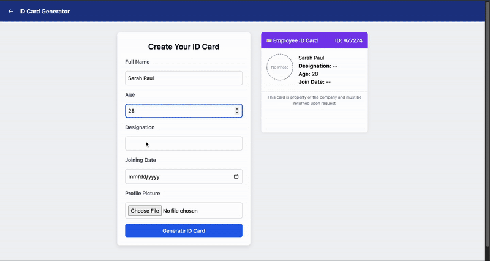

# ID Card Generator System 

This project is a web-based **ID Card Generator System** built with **Spring Boot**, **JavaScript**, **HTML/CSS**, and a **MySQL** backend. It allows users to enter personal details, choose from six professionally styled templates, preview their ID card live, and download a customized **PDF ID card** with all formatting and colors preserved.

---

## Demo





---

##  Features

-  **Form-based User Registration**  
  Enter full name, age, designation, joining date, and upload a profile picture.

-  **Template Selection Page**  
  Choose from 6 different top-strip colors, each representing a unique card theme.

-  **Live Card Preview**  
  Instantly see how your selected template and details look as a front and back card preview.

-  **PDF Export**  
  Download a PDF copy of your generated ID card with:
  - Rounded corners
  - Top and bottom color strips
  - Profile photo
  - Clean two-page layout (front + back)

-  **SQL Database Integration**  
  Stores user details and their selected template color for accurate PDF regeneration.

---

## 🛠 Tech Stack

- **Backend:** Java, Spring Boot, Spring Web, Spring Data JPA
- **Frontend:** HTML, Tailwind CSS, Vanilla JavaScript
- **Database:** MySQL
- **PDF Library:** iText PDF 7

---

##  Project Structure

```bash
├── src
│   ├── main
│   │   ├── java/com/idcard/idcardsystem
│   │   │   ├── controller/UserController.java
│   │   │   └── model/User.java
│   │   └── resources/static
│   │       ├── create.html
│   │       ├── templates.html
│   │       ├── view-cards.html
│   │       ├── preview-card.js
│   │       ├── view-cards.js
│   │       ├── templates.js
│   │       └── CSS files
```

---

##  How to Run

1. **Create MySQL Database:**
   ```sql
   CREATE DATABASE idcard_system;
   USE idcard_system;
   ```

2. **Run the App (from IDE or terminal):**
   ```
   ./mvnw spring-boot:run
   ```

3. **Access in Browser:**
   - Templates Page: `http://localhost:8080/templates.html`
   - Create Page: `http://localhost:8080/create.html`
   - View Cards: `http://localhost:8080/view-cards.html`

---

##  Resetting the Database

To clear all user data and reset the ID count:

```sql
TRUNCATE TABLE user;
```

---


## ✨ Author

Built by Leslie Osei-Anane as a full-stack Java + JavaScript integration project.
